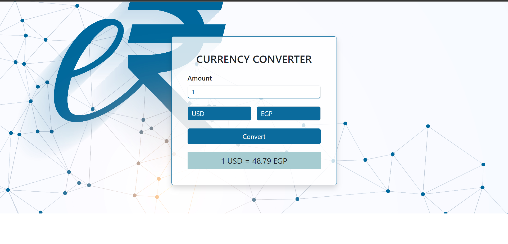

# Currency Converter

This project is a simple Currency Converter web application that allows users to convert a specified amount from one currency to another. The interface is built using HTML, CSS (including Bootstrap), and JavaScript.

## Table of Contents

- [Design](#design)
- [Getting Started](#getting-started)
- [Project Structure](#project-structure)
- [Dependencies](#dependencies)
- [How It Works](#how-it-works)
- [Usage](#usage)
- [Contributing](#contributing)
- [License](#license)
- [Links](#links)
- [Author](#author)

## Design



## Getting Started

To get started with the Currency Converter project, clone the repository and open the `index.html` file in your browser.

```bash
git clone https://github.com/yourusername/currency-converter.git
cd currency-converter
open index.html
```

## Project Structure

The project consists of the following main files:

- **index.html**: The main HTML file that includes the structure of the Currency Converter.
- **css/**: Contains the CSS stylesheets.
  - `all.min.css`: Font Awesome for icons.
  - `bootstrap.min.css`: Bootstrap for layout and styling.
  - `style.css`: Custom styles for the Currency Converter.
- **js/**: Contains JavaScript files.
  - `bootstrap.bundle.min.js`: Bootstrap JavaScript for interactivity.
  - `main.js`: Custom JavaScript for the Currency Converter logic.

## Dependencies

This project relies on the following dependencies:

- [Bootstrap](https://getbootstrap.com/): For responsive layout and styling.
- [Font Awesome](https://fontawesome.com/): For icons (if needed).
- Custom JavaScript (main.js) to handle the currency conversion logic.

## How It Works

The Currency Converter works by taking an input amount, selecting two currencies, and then converting the amount from the first currency to the second. The result is displayed on the screen.

### HTML Structure

- **Amount Input**: A numeric input field for the user to enter the amount to be converted.
- **Currency Select**: Two dropdowns for selecting the currencies (from and to).
- **Convert Button**: A button to trigger the conversion process.
- **Result Display**: A section where the conversion result is displayed.

### JavaScript Functionality

- The conversion logic is handled in the `main.js` file.
- The `convertBtn` triggers the conversion when clicked, and the result is displayed in the `resultText` paragraph.

## Usage

1. Open `index.html` in your browser.
2. Enter the amount you wish to convert.
3. Select the currencies from the dropdown menus.
4. Click on the "Convert" button to see the result.

## Contributing

If you would like to contribute to this project, feel free to fork the repository and submit a pull request.

## License

This project is licensed under the MIT License. See the [LICENSE](LICENSE) file for more details.

## Links

- **Repo**: [Github Repo](https://github.com/basemsameh/Currency-Converter.git)
- **Demo**: [Live URL](https://basemsameh.github.io/Currency-Converter/)

## Author

- **Name**: [Basem](Basem)
- **GitHub**: [GitHub Profile](https://github.com/basemsameh)
- **Linkedin**: [Linkedin](https://www.linkedin.com/in/basem-sameh-671b5b212/)